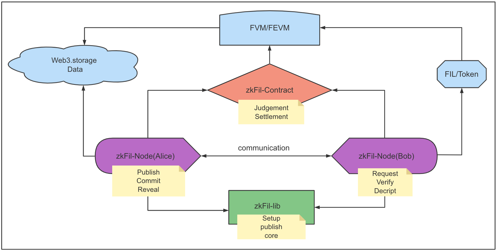
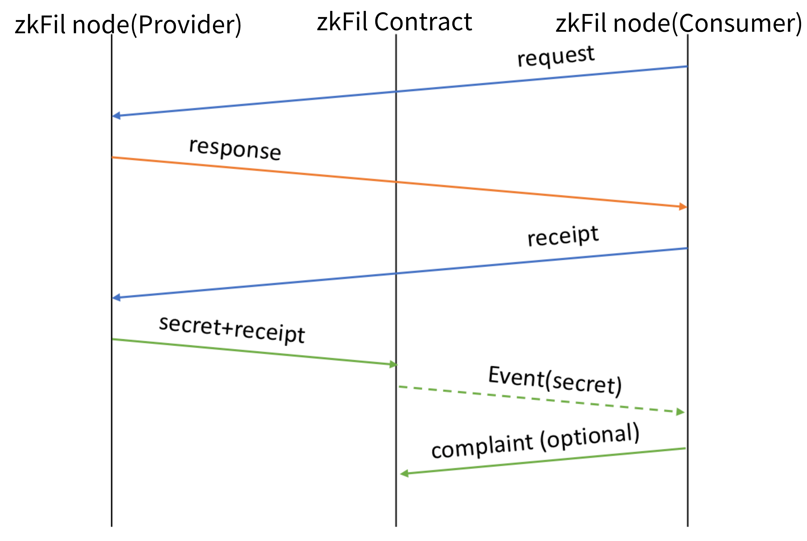

# zkFil: A decentralized system for data exchange based on Filecoin

## Overview

zkFil is a decentralized platform for data exchange between *untrusted parties* realizing "Payment on Delivery" without any *trusted third party* based on filecoin storage network. Instead, zkFil uses FVM/FEVM as a *trustless third party* to ensure fairness that no party can cheat during data exchange. Moreover, zkFil is concerned with users' privacy, hiding the intention of users to either miners or other parties. Any seller can publish data for:
- ***Data Downloading***: Buyers may pay-and-download a data file from a data seller. zkFil supports data fragments downloading, i.e., buyers may download specific data chunks in one batched transaction. 

- ***Data Query***:  zkFil supports structured data; e.g., the seller organizes data as tables. Multiple columns can be selected as indexed-columns, such that users may pay-and-query records in the table with one or more keywords, and get the records matched. zkFil ensures that the query results are trustworthy, i.e. (i) if data seller replies with n records, it is impossible that more records are matching that keyword in the table; (ii) these n records are precisely in the table, and any forged records cannot be allowed. 

The three main issues being tackled by zkFil are

+ The data is precisely what the buyer wants before payment,
+ The data must be delivered when the buyer pays,
+ The data won't be leaked before being paid.

A cryptographic protocol, PoD (proof of delivery), is developed to try to solve the issues, ensuring **fairness** between data buyers and sellers. The protocol is zero-knowledge and provable secure (*ongoing work*).

zkFil is practical and efficient. It could deliver data with TBs in theory. 

## Highlights 

+ Decentralization:  zkFil uses smart contracts on FEVM/FVM as the trustless third party. In theory, zkFil can be deployed on any FVM/FEVMs with basic smart contract support. The gas cost in transactions of data exchange is moderate, and the size of data can be up to TBs.
+ Atomic-swap:  zkFil supports atomic-swap (as in [ZKCP](https://en.bitcoin.it/wiki/Zero_Knowledge_Contingent_Payment)).
+ Large data file support.  zkFil supports delivering large data file within one transaction.
+ Data query by keywords:  zkFil supports pay-and-query. Before locating the records interested, a buyer may query for one or more keywords.
+ Privacy protection: The request of a buyer may be sensitive under some circumstances, the buyer can obfuscate her real intention by adding a few unrelated requests. Then the seller has to respond to all requests without knowing which one is real from the buyer, but she does know that only one response can be visible to the buyer since the buyer only paid for one request. 
+ Inspection of goods:  zkFil supports the inspection of goods for a buyer at any scale natively. The buyer can randomly select any piece of data at any location and takes it as a sample to check whether it is something she wants or not. Then, the buyer can continue to buy a large amount of data after a satisfied inspection. zkFil does not set a limit for the number of times a buyer could request for inspection. zkFil also ensures that every piece of data in every inspection coming from the same data set, including the final batch purchase.

## Project Structure

  

- [zkFil-node](node/) Node application written in Golang for sellers (Alice) and buyers (Bob). It deals with communication, smart contract calling, data transferring, and other zkFil protocol interactions.
- [zkFil-lib](lib/) zkFil core library written in C++ shipping with Golang bindings.
- [zkFil-contract](contract/) Smart contracts for zkFil *Decentralized Exchange*.

## Workflow and how it works

We briefly describe the workflow of transactions on zkFil by a simplified version of the PoD protocol. 

#### Data initialization

Data must be processed before being sold. Alice needs to compute the authenticators of data and the Merkle root of them. Authenticators are for data contents and origin verification (even if the data were encrypted). zkFil supports two modes: plain mode and table mode. 

+ plain mode
+ table mode (CSV files)

For tabulated data, each row is a record with fixed columns. The buyer may send queries with keywords. Note that the columns must be specified before data initialization to supports keywords.

#### Data transaction
For simplicity, we introduce two main types of trading mode for data delivery.

+ Atomic-swap mode

1. Bob sends request w.r.t. a data tag
2. Alice sends encrypted data to Bob (by a one-time random key)
3. Bob verifies the *encrypted* data with tag by using ZKP.
4. Bob accepts the data and submits a receipt to the contract (FVM/FEVM).
5. Alice checks the receipt and then reveals the key (for encrypting the data)
6. Contract (FVM/FEVM) verifies if the key matches the receipt and output "accept"/"reject."

+ Complaint mode (inspired by Fairswap)

1. Bob sends request w.r.t. a data tag
2. Alice sends encrypted data to Bob (by a one-time random key)
3. Bob verifies the *encrypted* data with tag by using ZKP.
4. Bob accepts the data and submits a receipt to the contract(FVM/FEVM).
5. Alice checks the receipt and then reveals the key (for encrypting the data)
6. Bob decrypts the data by the key and submits proof of misbehavior to the contract(FVM/FEVM) if he finds that Alice was cheating.

## License

And of course:
MIT: https://rem.mit-license.org

## Contribution
Thank you for considering to help out with the source code! We welcome contributions from anyone on the internet, and are grateful for even the smallest of fixes!

If you'd like to contribute to zkFil , please fork, fix, commit and send a pull request for the maintainers to review and merge into the main code base. 
